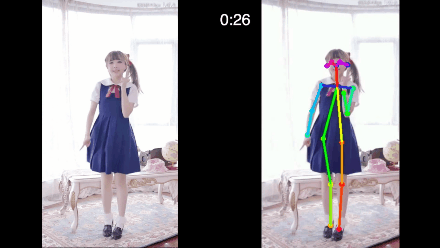
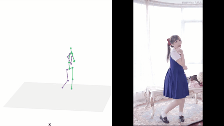
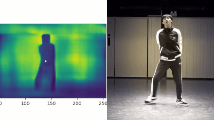
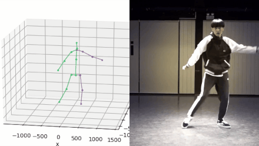
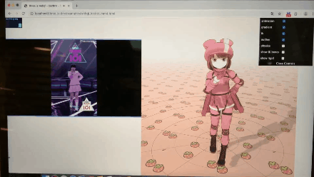

# Video2MMD

### Introduction

This project contains 4 steps

- Detect joint points of person in video
- Predict 3d postitions of joint points
- Predict depth of hip joint point using depth prediction model
- Combine previous result and apply to MMD model

### How to deploy project

1. Main Dependency
   - Tensorflow
   - h5py
   - OpenCV
   - three.js
   - flask
2. Pretrained Model
   - Please see references for details
3. Hardware Requirement
   - Server with Nvidia GeForce GTX 1080 Ti
4. Bash Commands

> OpenPose

```
python run_video_save4.py --model=cmu --video=./videos/yxj_com.mp4 --output_json=./result/result_json_yxj --output_video=./result/result_video/test_yxj.avi
```
> 3d pose

```
python src/openpose_3dpose_sandbox_vmd.py --camera_frame --residual --batch_norm --dropout 0.5 --max_norm --evaluateActionWise --use_sh --epochs 200 --sample --load 4874200 --gif_fps 60
```

> depth prediction

```
python video_predict.py —model_path=‘./models/NYU_FCRN.ckpt’ —video_path=‘1.mp4’ —baseline=./ —interval=1 —verbose=2
```

> transform to VMD file

```
python VMD_3D_Pose_Baseline_Multi-Objects/applications/pos2vmd_multi_modify_angle.py -v 2 -t1 3d-pose-output -t2 depth-output -t3 vmd-output -b VMD_3D_Pose_Baseline_Multi-Objects/applications/animasa_miku_born.csv -c 30 -z 6 -x 0 -m 0 -i 0 -d 0 -a 1 -k 1 -e 0 -cl -20 -cr 20
```

> Start Sever

```
cd web_test
python app.py
```

run at 127.0.0.1:5000

uploading video on webpage will automatically call bash file and generate new vmd result. (*run_draft3.sh*)

change parameters on webpage will also generate new vmd file. (*run_vmd.sh*)

### Results
> OpenPose



> 3d pose baseline



> depth prediction



> depth visualization

this part's code is in depth_viz/*



> animation model



### References

- https://github.com/CMU-Perceptual-Computing-Lab/openpose
- https://github.com/ildoonet/tf-pose-estimation
- https://github.com/una-dinosauria/3d-pose-baseline
- https://github.com/iro-cp/FCRN-DepthPrediction
- https://github.com/miu200521358/VMD-3d-pose-baseline-multi